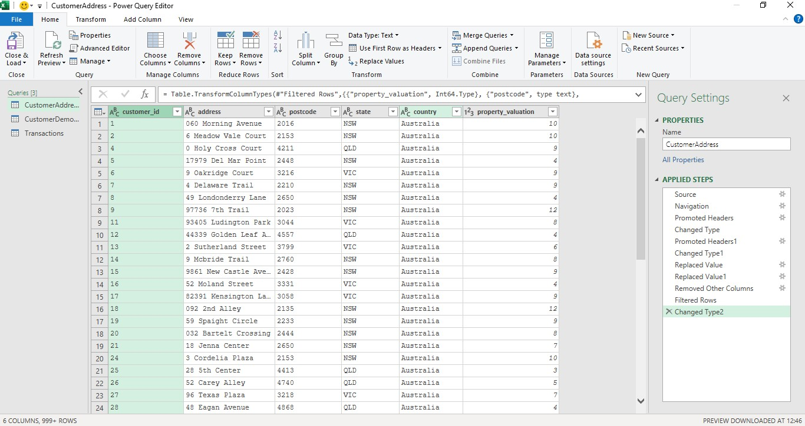
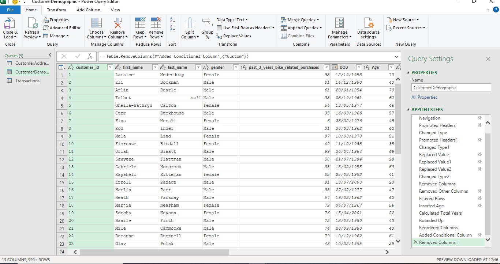
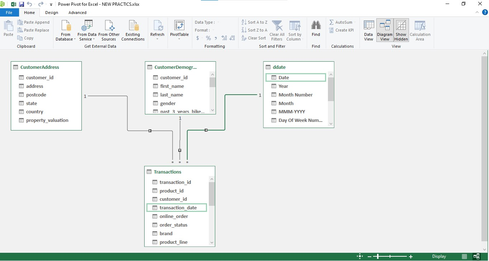
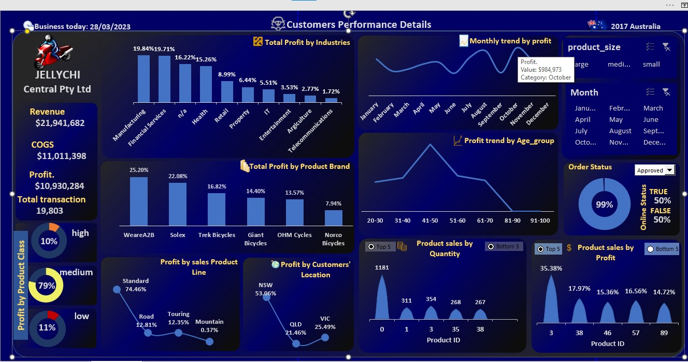

# Jellychi-Analysis-

## Introduction 
This is an Excel Customer Performance dasboard report on an imaginary store called **Jellychi Ltd**. The progect is to analyze and derive insight to answer critical questions which could the company make data-driven decisions.
###### **_Disclaimer_**: All dataset and reporrt does not repreent any company, institution or country, just a dumy dataset. 
----------------

## Problem statement 
1. Which of the product is the best selling?
2. What are the total sales and profit/ loss that was made over the year? 
3. What month of the year has the highest sales? 
4. What category of industries has the highest sales and those with the least sales?
5. Which region is the most productive? 
6. Is the e-services effective?
7. Any other relevant data-driven insight into our sales. 

## Data Sourcing 
The data was an Excel file downloaded from a virtual internship class in other to get hands dirty and solve business challenge.  The file was launched in Microsoft Excel for cleaning, analysis and visualization.
It contains 3 sheets/tables:
- Customer Demographic with 4000 rows and 10 columns  
- Customer Address with 4,000 rows and 6 columns 
- Transaction Data	with 20,000 rows and 13 columns 

## Skills demonstration
The following Microsoft Excel features were incorporated:
Dax concept, calculated columns, measures, Data modelling, power pivot, pivot table and charts, filters, developer(option button)

## Data transformation 
Data was efficiently tested for its Quality, cleaned and transformed using with Power Query Editor in Excel(a screenshot attached below ). Some of the applied steps includes:
- Promotion of Header
- Values replacement where there are inconsistences in a column such as gender, location… 
- Changing of data types ( e.g Customers_id from ‘number’ to ‘text’ )
- Analytical transformation of Customer Demographic table:  a new column for Age derived from their date of birth so as to be able to group them into section by age 
- Conditional column was added Customer Demographic as to put their ages in groups.

**Power Query 1**
    
|  
 **Power Query 2**

## Modelling
Data was modelled in the Power Pivot for excel. The transaction table is the fact table of this model and the other three dimension tables Customer Demographic, Customer Address and Date table (which was created in power pivot) are connected to the fact table using their primary keys; Customers_id and date respectively.

## Analysis and Visualization

1.	From the dashboard the best-selling product by number of item sold is not the best in profit generation. From the visual items with product_id 3 and product_id 38 are the best sold and profit generating. 
2.	The total sales, cost of goods sold, profit and total transaction made over the year are: $21,941,682, $11,011,398, $10,930,284 and 19,803 respectively. 
3.	Sales tends to be at its apex in October 
4.	The manufacturing industry tends to be most yielding followed by the financial services. 
5.	Sales tends to be very high(of about 50% compared to other region) in New south Wales. 
6.	The e-services are very effective: 99% of orders made are approved. 
#### Any other relevant data-driven insight into our sales. 
- Customers tends to buy medium size items than the large and small

- Top five Customers 

customer_id                         |         Profit
:----------------------------------:|:-------------------------------:
1460                                |         $10,788
1558                                |         $10,640
2637                                |	        $11,223
729	                                |         $10,498
941	                                |         $11,669

## Conclusion and Recommendation  
- profit was made across the year.
- Production of more of medium size items.
- Advertisement of product are more needed in Queensland.
- People between the age of 40 and 50 tends to be the major focus.   
